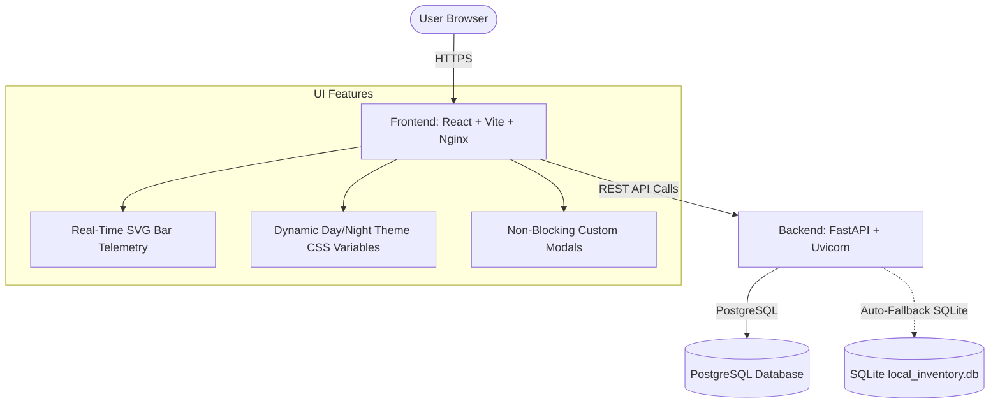

# 🌌 Nexus Stock: Enterprise Inventory & Order CRM System

Nexus Stock is a production-ready, containerized full-stack application designed to streamline product inventory, customer relationship pipelines, and checkout transactions. It features a high-performance **FastAPI backend** (with SQLAlchemy 2.0 and auto-migration) and a beautiful, custom **React + Vite frontend** with modern layouts, real-time telemetry, and micro-animations.

---

## 🔗 Production Access

* **Frontend Client (Vercel)**: [https://invetory-system-mu.vercel.app](https://invetory-system-mu.vercel.app/)
* **Backend API Docs (Render)**: [https://invetory-system-h9i7.onrender.com/docs](https://invetory-system-h9i7.onrender.com/docs)
* **Backend API Health Check**: [https://invetory-system-h9i7.onrender.com/health](https://invetory-system-h9i7.onrender.com/health)

---

## 🛠️ System Architecture



---

## ✨ Features & Core Capabilities

### 📊 Real-Time Analytics & Dashboard Telemetry
* **SVG Telemetry Bar Chart**: Custom, dynamic SVG-based vertical bar graph showing the top 5 stocked items.
* **Low Stock Gauges**: Active warning system reporting critical inventory deficiencies.
* **Metric Overviews**: Quick glance counts of total inventory items, total orders completed, and active customers pipelines.

### 🌓 Premium Theme System
* **Fluid Day/Night Mode**: A stateful theme engine using custom CSS variables (`--bg-main`, `--text-main`, `--glass-bg`, etc.) to toggle dark-mode elements or eye-friendly light-mode layouts dynamically.
* **Anti-Fade Visibility**: Built-in styling safeguards ensuring that contrast ratios remain compliant across themes.

### 🛡️ Non-Blocking UX & INP Optimization
* **React Confirmation Modals**: Thread-blocking native popups (`window.confirm`) are replaced with custom, non-blocking glassmorphic modals. This removes browser Interaction to Next Paint (INP) latency issues and preserves visual unity.
* **Double-Submit Protection**: Submit buttons across all creation pipelines (Customers, Products, Orders) dynamically lock using a stateful `submitting` loader to prevent accidental duplicate actions from double-clicks.

### 🔄 Asynchronous Resiliency Backend
* **Database Driver Fallback**: Seamless database resilience. The backend automatically switches to SQLite if the remote PostgreSQL cluster is unreachable during offline local development.
* **Dynamic Migrator Engine**: Auto-inspects existing database schemas on startup. Performs safe `ALTER TABLE` operations dynamically if columns (such as `currency`) are missing.

---

## 🛠️ Tech Stack Details

| Component | Technology | Role / Advantage |
| :--- | :--- | :--- |
| **Backend API** | FastAPI | High-performance, async web framework based on Starlette and Pydantic |
| **ASGI Server** | Uvicorn | Blazingly fast lightning-weight ASGI server |
| **Database ORM** | SQLAlchemy 2.0 | Next-generation SQL toolkit for optimized transaction control |
| **Frontend Client**| React 18 + Vite | Accelerated modern bundling and component-driven view rendering |
| **Routing Manager**| React Router v6 | Declarative client-side view management |
| **HTTP client** | Axios | Normalized AJAX processing with robust request/response interceptors |

---

## ⚡ REST API Specifications

The FastAPI backend exposes several highly structured endpoints. Here is a quick reference:

### 📈 Dashboard Telemetry
* `GET /api/dashboard/stats` - Returns overall counts of orders, products, and customers.
* `GET /api/dashboard/telemetry` - Returns real-time metrics, low-stock warnings, and structured top stock counts for the SVG Bar Chart.

### 📦 Stock Inventory
* `GET /api/products` - List all inventory items.
* `POST /api/products` - Register a new product with custom SKUs.
* `PUT /api/products/{id}` - Update product pricing, currency settings, or stock numbers.
* `DELETE /api/products/{id}` - Remove an item from warehouse records.

### 👥 Customer Pipelines
* `GET /api/customers` - Fetch active customer directory.
* `POST /api/customers` - Register new clients with unique emails.
* `DELETE /api/customers/{id}` - Remove customer record and void associated orders.

### 🛒 Checkout Transactions
* `GET /api/orders` - View all historical invoice logs.
* `POST /api/orders` - Submit a multi-item checkout cart (automatically decrements stock).
* `DELETE /api/orders/{id}` - Cancel and void order (automatically restores items back to inventory).

---

## 🚀 Local Development Guide

### Option A: Using Docker Compose (Recommended)
Launch the entire system in containerized isolation. Requires [Docker Desktop](https://www.docker.com/products/docker-desktop/):

1. **Clone the repository**:
   ```bash
   git clone https://github.com/saqib7903/Invetory-system.git
   cd Invetory-system
   ```
2. **Boot the complete stack**:
   ```bash
   docker compose up --build -d
   ```
3. **Access Services locally**:
   * Frontend Client UI: [http://localhost](http://localhost) (Port `80`)
   * Swagger Interactive API Docs: [http://localhost:8000/docs](http://localhost:8000/docs) (Port `8000`)
   * Database System: `localhost:5432`

---

### Option B: Native Setup (Without Containers)

#### 1. Backend Server
1. Navigate to the backend directory:
   ```bash
   cd backend
   ```
2. Create and active a Python virtual environment:
   ```bash
   python -m venv venv
   # Windows:
   venv\Scripts\activate
   # macOS/Linux:
   source venv/bin/activate
   ```
3. Install dependencies:
   ```bash
   pip install -r requirements.txt
   ```
4. Fire up the backend ASGI server (falls back to local `local_inventory.db` SQLite if no Postgres `.env` credentials exist):
   ```bash
   uvicorn app.main:app --reload --host 127.0.0.1 --port 8000
   ```

#### 2. Frontend Client
1. Navigate to the frontend directory:
   ```bash
   cd frontend
   ```
2. Install npm packages:
   ```bash
   npm install
   ```
3. Boot the Vite hot-reloading development server:
   ```bash
   npm run dev
   ```
4. Access the web app via [http://localhost:5173](http://localhost:5173).

---

## ⚙️ Environment Variables Reference

### Backend `.env` Config
| Variable Name | Default Value | Description |
| :--- | :--- | :--- |
| `DATABASE_URL` | *(None)* | PostgreSQL Connection String. Fallback-switches to SQLite if left empty or offline. |
| `ALLOWED_ORIGINS` | `*` | Comma-separated CORS origins allowed to access endpoints. |

### Frontend `.env` / Vite Config
| Variable Name | Default Value | Description |
| :--- | :--- | :--- |
| `VITE_API_URL` | `http://localhost:8000/api` | Points Axios instances to backend API servers. |

---

## 📂 Repository Directory Layout
```text
inventory-system/
├── backend/
│   ├── app/
│   │   ├── routers/       # Endpoints split by CRM domain
│   │   ├── crud.py        # Optimized DB queries
│   │   ├── database.py    # Resilience handlers & fallback engine
│   │   ├── models.py      # SQLAlchemy model schema declarations
│   │   ├── schemas.py     # Pydantic serialization models
│   │   └── main.py        # Main FastAPI entry point
│   ├── Dockerfile
│   └── requirements.txt
├── frontend/
│   ├── src/
│   │   ├── components/    # Reusable Sidebars and custom Modals
│   │   ├── context/       # State contexts (e.g. Toast alerts)
│   │   ├── pages/         # Page templates (Dashboard, Products, Orders)
│   │   ├── services/      # Axios service clients
│   │   └── index.css      # Core fluid design system tokens
│   ├── Dockerfile
│   └── package.json
└── docker-compose.yml     # Containerized architecture orchestra
```

---

## 🤝 Contribution Guidelines
We welcome contributions to expand the CRM pipelines or telemetry analytics!
1. Fork the project.
2. Create your Feature Branch (`git checkout -b feature/AmazingFeature`).
3. Commit your changes (`git commit -m 'Add some AmazingFeature'`).
4. Push to the Branch (`git push origin feature/AmazingFeature`).
5. Open a Pull Request.

---

## 📜 License
Distributed under the **MIT License**. See `LICENSE` for more details.
