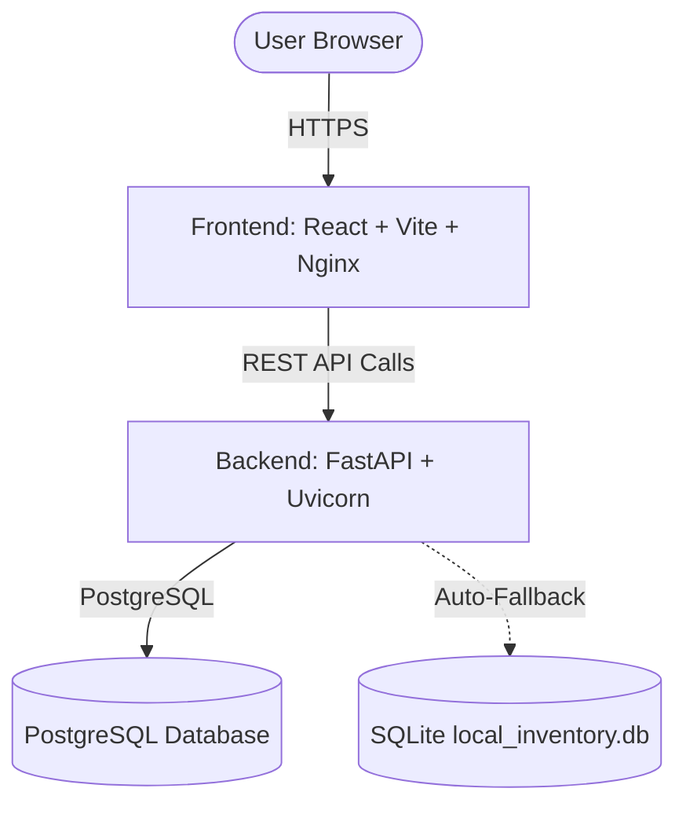

# Nexus Stock: Inventory & Order Management System

Nexus Stock is a production-ready, containerized full-stack application designed to streamline product inventory, customer registration, and order history. It features a robust **FastAPI backend** (backed by PostgreSQL with SQLite fallback) and a blazingly fast **React + Vite frontend** served via Nginx.

---

## 🔗 Live Deployments

* **Frontend UI (Vercel)**: [https://invetory-system-mu.vercel.app](https://invetory-system-mu.vercel.app/)
* **Backend API Docs (Render)**: [https://invetory-system-h9i7.onrender.com/docs](https://invetory-system-h9i7.onrender.com/docs)
* **Backend API Health Check**: [https://invetory-system-h9i7.onrender.com/health](https://invetory-system-h9i7.onrender.com/health)

---

## 🛠️ Architecture & Tech Stack



### Backend (API)
* **Framework**: FastAPI (Asynchronous Python Web framework)
* **Server**: Uvicorn (ASGI web server)
* **ORM**: SQLAlchemy 2.0 with PostgreSQL drivers (`psycopg2-binary`)
* **Resiliency**: Built-in **PostgreSQL connections pool pre-pings** and **automatic fallback to local SQLite** if PostgreSQL is offline during development.
* **Dynamic Migrator**: Automatic startup inspector that detects if tables are missing fields (e.g. `currency`) and executes safe non-destructive `ALTER TABLE` schema adjustments automatically.

### Frontend (UI)
* **Framework**: React 18 with Vite build tool
* **Styling**: Vanilla CSS with modern layout patterns, premium gradients, and micro-animations
* **Routing**: Client-side routing with React Router, fully backed by `vercel.json` rewrites and `nginx.conf` fallbacks to prevent 404 errors on refreshes.
* **HTTP Client**: Axios with standardized error interceptors.

---

## 🚀 Local Development

### Option A: Using Docker Compose (Recommended)
Make sure you have [Docker Desktop](https://www.docker.com/products/docker-desktop/) installed and running:

1. **Clone the repository**:
   ```bash
   git clone https://github.com/saqib7903/Invetory-system.git
   cd Invetory-system
   ```
2. **Launch the complete stack**:
   ```bash
   docker compose up --build -d
   ```
3. **Access the services**:
   * Frontend Web UI: [http://localhost](http://localhost) (Port `80`)
   * Backend Swagger API Docs: [http://localhost:8000/docs](http://localhost:8000/docs) (Port `8000`)
   * Database Server: `localhost:5432`

---

### Option B: Running Natively

#### 1. Backend Setup
1. Navigate to the `backend` folder:
   ```bash
   cd backend
   ```
2. Create and activate a virtual environment:
   ```bash
   python -m venv venv
   # On Windows:
   venv\Scripts\activate
   # On macOS/Linux:
   source venv/bin/activate
   ```
3. Install dependencies:
   ```bash
   pip install -r requirements.txt
   ```
4. Start the FastAPI server (will fall back to a local SQLite file automatically if no Postgres database is configured in `.env`):
   ```bash
   uvicorn app.main:app --reload --host 127.0.0.1 --port 8000
   ```

#### 2. Frontend Setup
1. Navigate to the `frontend` folder:
   ```bash
   cd frontend
   ```
2. Install dependencies:
   ```bash
   npm install
   ```
3. Run the development server:
   ```bash
   npm run dev
   ```
4. Open the link provided in the console (usually [http://localhost:5173](http://localhost:5173)).

---

## ☁️ Cloud Deployment Configuration

This repository is optimized for quick hosting splits:

### 1. Backend on Render (Web Service via Docker)
* **Root Directory**: `backend`
* **Runtime**: `Docker` (automatically parses `backend/Dockerfile` for high security and layer-cached compilation)
* **Required Env Variables**:
  * `DATABASE_URL`: `postgresql://<user>:<password>@<host>/<dbname>` (Render PostgreSQL database connection URL)
  * `ALLOWED_ORIGINS`: `http://localhost:5173,https://invetory-system-mu.vercel.app` (restricts CORS requests to specified host addresses)

### 2. Frontend on Vercel (Static Site via Vite)
* **Root Directory**: `frontend`
* **Framework Preset**: `Vite`
* **Required Env Variables**:
  * `VITE_API_URL`: `https://invetory-system-h9i7.onrender.com/api` (points Axios clients to the Render API endpoint)
* **SPA Routing Fallback**: Powered by the [`frontend/vercel.json`](frontend/vercel.json) configuration file to resolve React Router client paths.
